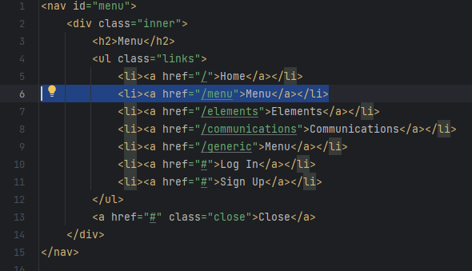
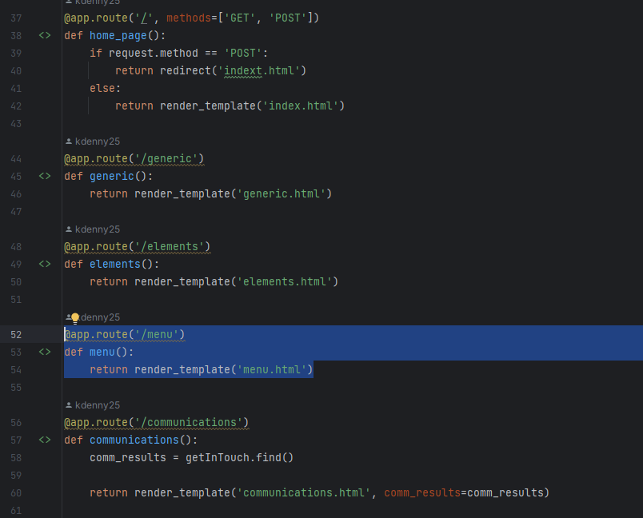

# Python Flask Backend Key Points

This readme is intended to decipher some of the backend so members of group 1 can make
changes to the application as needed.

If you want a brief of what Flask is then check out the link below. 

https://pythonbasics.org/what-is-flask-python/

### Index

* [Adding a webpage to navigation](#webpage-navigation)
* [Adding images to a webpage](#adding-images)

### <a id='webpage-navigation'> Adding a webpage to navigation </a>

This portion assumes a webpage is already created. We will use menu.html as an example.

1. Open /templates/elements/navigation.html
2. In navigation.html add the highlighted line of code where you want the link to
show up. Make note of the href reference to /menu. This is an endpoint url, the same
as "https://mywebsite/menu" just in shorter form. Flask will recognize this and return
run a function as long as there is a function associated to the endpoint. 

`<li><a href="/menu">Menu</a></li>`

3. Now open app.py in the root folder.
4. This is where all the endpoint functions are located. To establish a response to a
you would first add @app.route("/menu) followed by the function. The function name can 
be anything just be sure it is unique. in this case it is def menu(): then return the 
html file using, return render_template('menu.html'). Below is the code and an image
showing where you can place it.

    app.route('/menu')
    def menu():
        return render_template('menu.html')

    

Now you should be able to click the link and navigate to your new webpage.

### <a id='adding-images'> Adding images to a webpage</a>

1. Save the image to `static/images/`
2. In the webpage html add the following block of code to add an image to the
webpage.

